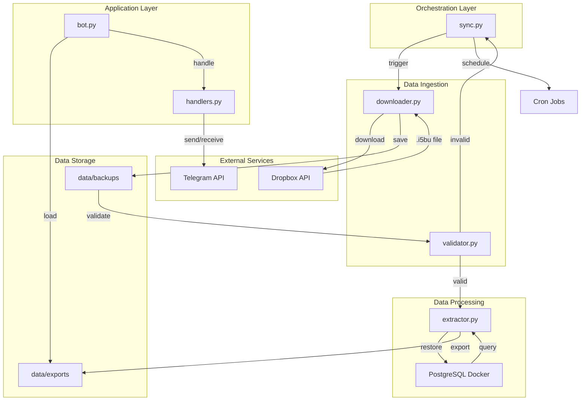

# Architecture Proposal - Telegram Bot Toko

## Current Issues & Improvements

### Identified Problems

1. **Hardcoded Configuration**
   - API tokens and paths are hardcoded in source files
   - No environment-based configuration
   - Security risk for credentials

2. **Poor Separation of Concerns**
   - Business logic mixed with configuration
   - No clear module boundaries
   - Difficult to test individual components

3. **Manual Process Coordination**
   - Scripts must be run manually in sequence
   - No orchestration or workflow management
   - Error handling is fragmented

4. **Lack of Monitoring & Logging**
   - Minimal logging across components
   - No health checks or monitoring
   - Difficult to diagnose issues

5. **No Data Validation**
   - No validation of downloaded files
   - No verification of CSV structure
   - Silent failures possible

6. **Scalability Issues**
   - Single bot instance
   - No horizontal scaling capability
   - Database container recreated on each run

## Proposed Architecture

### New Project Structure

```
telegram-bot-toko/
├── config/
│   ├── .env.example                 # Environment template
│   ├── .env                         # Actual environment (gitignored)
│   ├── logging.conf                 # Logging configuration
│   └── settings.py                  # Settings loader
│
├── src/
│   ├── __init__.py
│   │
│   ├── core/
│   │   ├── __init__.py
│   │   ├── config.py                # Configuration management
│   │   ├── logger.py                # Logging setup
│   │   └── exceptions.py            # Custom exceptions
│   │
│   ├── data/
│   │   ├── __init__.py
│   │   ├── downloader.py            # Dropbox downloader
│   │   ├── extractor.py             # Database extractor
│   │   ├── validator.py             # Data validation
│   │   └── models.py                # Data models
│   │
│   ├── bot/
│   │   ├── __init__.py
│   │   ├── bot.py                   # Main bot application
│   │   ├── handlers.py              # Telegram handlers
│   │   ├── commands.py              # Command definitions
│   │   └── middleware.py            # Bot middleware
│   │
│   ├── database/
│   │   ├── __init__.py
│   │   ├── connection.py            # Database connection
│   │   └── queries.py               # SQL queries
│   │
│   └── utils/
│       ├── __init__.py
│       ├── file_utils.py            # File operations
│       └── date_utils.py            # Date/time utilities
│
├── scripts/
│   ├── sync.py                      # Main sync orchestration
│   ├── download.py                  # Download only
│   ├── extract.py                   # Extract only
│   └── cleanup.py                   # Cleanup old files
│
├── docker/
│   ├── postgres/
│   │   ├── Dockerfile
│   │   └── init.sql
│   └── docker-compose.yml
│
├── tests/
│   ├── __init__.py
│   ├── test_downloader.py
│   ├── test_extractor.py
│   ├── test_bot.py
│   └── fixtures/
│       └── test_data.csv
│
├── logs/
│   ├── downloader.log
│   ├── extractor.log
│   └── bot.log
│
├── data/
│   ├── backups/                     # Downloaded .i5bu files
│   └── exports/                     # Exported CSV files
│
├── docs/
│   ├── ARCHITECTURE.md              # This file
│   ├── API.md                       # API documentation
│   └── DEPLOYMENT.md                # Deployment guide
│
├── requirements.txt                 # Python dependencies
├── requirements-dev.txt             # Development dependencies
├── setup.py                         # Package setup
├── .gitignore
├── .env.example
├── docker-compose.yml
├── Makefile                         # Common commands
└── README.md
```

## Improved Data Flow



## Component Architecture

### 1. Configuration Management

**File**: [`src/core/config.py`](src/core/config.py)

```python
from dataclasses import dataclass
from pathlib import Path
import os
from dotenv import load_dotenv

@dataclass
class DropboxConfig:
    app_key: str
    app_secret: str
    refresh_token: str
    folder_path: str

@dataclass
class TelegramConfig:
    bot_token: str
    allowed_users: list[int]

@dataclass
class DatabaseConfig:
    host: str
    port: int
    database: str
    user: str
    password: str

@dataclass
class PathConfig:
    project_root: Path
    data_dir: Path
    backups_dir: Path
    exports_dir: Path
    logs_dir: Path

@dataclass
class AppConfig:
    dropbox: DropboxConfig
    telegram: TelegramConfig
    database: DatabaseConfig
    paths: PathConfig
    max_csv_files: int = 5
    search_results_limit: int = 10

def load_config() -> AppConfig:
    load_dotenv()
    project_root = Path(__file__).parent.parent.parent

    return AppConfig(
        dropbox=DropboxConfig(
            app_key=os.getenv('DROPBOX_APP_KEY'),
            app_secret=os.getenv('DROPBOX_APP_SECRET'),
            refresh_token=os.getenv('DROPBOX_REFRESH_TOKEN'),
            folder_path=os.getenv('DROPBOX_FOLDER_PATH', '/IPOS')
        ),
        telegram=TelegramConfig(
            bot_token=os.getenv('TELEGRAM_BOT_TOKEN'),
            allowed_users=list(map(int, os.getenv('ALLOWED_USERS', '').split(',')))
        ),
        database=DatabaseConfig(
            host=os.getenv('DB_HOST', 'localhost'),
            port=int(os.getenv('DB_PORT', '5432')),
            database=os.getenv('DB_NAME', 'i5bu'),
            user=os.getenv('DB_USER', 'postgres'),
            password=os.getenv('DB_PASSWORD', 'postgres')
        ),
        paths=PathConfig(
            project_root=project_root,
            data_dir=project_root / 'data',
            backups_dir=project_root / 'data' / 'backups',
            exports_dir=project_root / 'data' / 'exports',
            logs_dir=project_root / 'logs'
        ),
        max_csv_files=int(os.getenv('MAX_CSV_FILES', '5')),
        search_results_limit=int(os.getenv('SEARCH_RESULTS_LIMIT', '10'))
    )
```

### 2. Data Downloader

**File**: [`src/data/downloader.py`](src/data/downloader.py)

```python
import requests
from typing import Optional
from pathlib import Path
from .models import BackupFile
from ..core.logger import get_logger

class DropboxDownloader:
    def __init__(self, config: DropboxConfig):
        self.config = config
        self.logger = get_logger('downloader')
        self._access_token: Optional[str] = None

    def refresh_access_token(self) -> str:
        """Refresh Dropbox access token"""
        response = requests.post(
            'https://api.dropboxapi.com/oauth2/token',
            auth=(self.config.app_key, self.config.app_secret),
            data={
                'grant_type': 'refresh_token',
                'refresh_token': self.config.refresh_token
            }
        )
        response.raise_for_status()
        self._access_token = response.json()['access_token']
        return self._access_token

    def list_backups(self) -> list[BackupFile]:
        """List all .i5bu backup files"""
        token = self.refresh_access_token()

        response = requests.post(
            'https://api.dropboxapi.com/2/files/list_folder',
            headers={'Authorization': f'Bearer {token}'},
            json={'path': self.config.folder_path}
        )
        response.raise_for_status()

        files = []
        for entry in response.json().get('entries', []):
            if entry['name'].endswith('.i5bu'):
                files.append(BackupFile(
                    name=entry['name'],
                    path=entry['path_display'],
                    modified=entry['server_modified']
                ))

        return sorted(files, key=lambda f: f.modified, reverse=True)

    def download_latest(self, destination: Path) -> Path:
        """Download the latest backup file"""
        backups = self.list_backups()
        if not backups:
            raise FileNotFoundError("No backup files found")

        latest = backups[0]
        self.logger.info(f"Downloading latest backup: {latest.name}")

        token = self.refresh_access_token()

        # Get temporary download link
        response = requests.post(
            'https://api.dropboxapi.com/2/files/get_temporary_link',
            headers={'Authorization': f'Bearer {token}'},
            json={'path': latest.path}
        )
        response.raise_for_status()

        download_url = response.json()['link']

        # Download file
        file_response = requests.get(download_url)
        file_response.raise_for_status()

        destination.parent.mkdir(parents=True, exist_ok=True)
        destination.write_bytes(file_response.content)

        self.logger.info(f"Downloaded to: {destination}")
        return destination
```

### 3. Data Extractor

**File**: [`src/data/extractor.py`](src/data/extractor.py)

```python
import subprocess
import pandas as pd
from pathlib import Path
from typing import Optional
from datetime import datetime
from .models import ProductData
from ..core.config import AppConfig
from ..core.logger import get_logger

class DatabaseExtractor:
    def __init__(self, config: AppConfig):
        self.config = config
        self.logger = get_logger('extractor')

    def ensure_database_running(self) -> bool:
        """Ensure PostgreSQL container is running"""
        try:
            result = subprocess.run(
                ['docker', 'ps', '--format', '{{.Names}}'],
                capture_output=True,
                text=True,
                check=True
            )
            return 'pg-i5bu' in result.stdout
        except subprocess.CalledProcessError:
            return False

    def restore_database(self, backup_file: Path) -> bool:
        """Restore database from backup file"""
        self.logger.info(f"Restoring database from: {backup_file}")

        commands = [
            f"docker exec -u postgres pg-i5bu dropdb --if-exists {self.config.database.database}",
            f"docker exec -u postgres pg-i5bu createdb {self.config.database.database}",
            f"docker exec -u postgres pg-i5bu pg_restore -U postgres "
            f"--no-owner --no-privileges -d {self.config.database.database} /backup/{backup_file.name}"
        ]

        for cmd in commands:
            result = subprocess.run(cmd, shell=True, capture_output=True, text=True)
            if result.returncode != 0:
                self.logger.error(f"Command failed: {cmd}")
                self.logger.error(result.stderr)
                return False

        self.logger.info("Database restored successfully")
        return True

    def export_to_csv(self, output_path: Path) -> Path:
        """Export product data to CSV"""
        query = """
            SELECT i.namaitem, s.jumlahkonv AS konversi, s.satuan,
                   s.hargapokok, h.hargajual
            FROM tbl_item i
            JOIN tbl_itemsatuanjml s ON i.kodeitem = s.kodeitem
            JOIN tbl_itemhj h ON i.kodeitem = h.kodeitem AND s.satuan = h.satuan
        """

        cmd = (
            f"docker exec -u postgres pg-i5bu psql -U postgres "
            f"-d {self.config.database.database} -c "
            f"\"\\COPY ({query}) TO '/output/{output_path.name}' WITH CSV HEADER\""
        )

        result = subprocess.run(cmd, shell=True, capture_output=True, text=True)
        if result.returncode != 0:
            self.logger.error("CSV export failed")
            self.logger.error(result.stderr)
            raise RuntimeError("CSV export failed")

        self.logger.info(f"Exported to: {output_path}")
        return output_path

    def load_csv(self, csv_path: Path) -> pd.DataFrame:
        """Load CSV file into DataFrame"""
        return pd.read_csv(csv_path)

    def cleanup_old_files(self, keep_count: Optional[int] = None):
        """Remove old CSV files, keeping only the most recent"""
        keep_count = keep_count or self.config.max_csv_files

        csv_files = sorted(
            self.config.paths.exports_dir.glob('*.csv'),
            key=lambda p: p.stat().st_mtime,
            reverse=True
        )

        if len(csv_files) > keep_count:
            for old_file in csv_files[keep_count:]:
                old_file.unlink()
                self.logger.info(f"Removed old file: {old_file.name}")
```

### 4. Data Validator

**File**: [`src/data/validator.py`](src/data/validator.py)

```python
import pandas as pd
from pathlib import Path
from typing import Optional
from ..core.logger import get_logger

class DataValidator:
    REQUIRED_COLUMNS = ['namaitem', 'konversi', 'satuan', 'hargapokok', 'hargajual']

    def __init__(self):
        self.logger = get_logger('validator')

    def validate_backup_file(self, backup_path: Path) -> bool:
        """Validate that backup file exists and is not empty"""
        if not backup_path.exists():
            self.logger.error(f"Backup file not found: {backup_path}")
            return False

        if backup_path.stat().st_size == 0:
            self.logger.error(f"Backup file is empty: {backup_path}")
            return False

        self.logger.info(f"Backup file validated: {backup_path}")
        return True

    def validate_csv(self, csv_path: Path) -> tuple[bool, Optional[str]]:
        """Validate CSV structure and content"""
        try:
            df = pd.read_csv(csv_path)

            # Check required columns
            missing_cols = set(self.REQUIRED_COLUMNS) - set(df.columns)
            if missing_cols:
                error = f"Missing columns: {missing_cols}"
                self.logger.error(error)
                return False, error

            # Check for empty data
            if df.empty:
                error = "CSV file is empty"
                self.logger.error(error)
                return False, error

            # Check for null values in critical columns
            null_counts = df[self.REQUIRED_COLUMNS].isnull().sum()
            if null_counts.any():
                error = f"Null values found: {null_counts[null_counts > 0].to_dict()}"
                self.logger.warning(error)
                # Warning, not error

            self.logger.info(f"CSV validated: {csv_path} ({len(df)} rows)")
            return True, None

        except Exception as e:
            error = f"CSV validation failed: {str(e)}"
            self.logger.error(error)
            return False, error
```

### 5. Orchestration Script

**File**: [`scripts/sync.py`](scripts/sync.py)

```python
import sys
from pathlib import Path
from datetime import datetime

# Add src to path
sys.path.insert(0, str(Path(__file__).parent.parent / 'src'))

from core.config import load_config
from core.logger import get_logger
from data.downloader import DropboxDownloader
from data.extractor import DatabaseExtractor
from data.validator import DataValidator

def main():
    logger = get_logger('sync')

    try:
        # Load configuration
        config = load_config()
        logger.info("Starting sync process")

        # Initialize components
        downloader = DropboxDownloader(config.dropbox)
        extractor = DatabaseExtractor(config)
        validator = DataValidator()

        # Step 1: Download latest backup
        timestamp = datetime.now().strftime('%d%m%Y-%H%M')
        backup_filename = f"backup_{timestamp}.i5bu"
        backup_path = config.paths.backups_dir / backup_filename

        logger.info("Step 1: Downloading backup from Dropbox")
        downloader.download_latest(backup_path)

        # Step 2: Validate backup
        logger.info("Step 2: Validating backup file")
        if not validator.validate_backup_file(backup_path):
            raise RuntimeError("Backup validation failed")

        # Step 3: Restore database
        logger.info("Step 3: Restoring database")
        if not extractor.ensure_database_running():
            raise RuntimeError("Database container not running")

        if not extractor.restore_database(backup_path):
            raise RuntimeError("Database restoration failed")

        # Step 4: Export to CSV
        logger.info("Step 4: Exporting to CSV")
        csv_filename = f"{timestamp}.csv"
        csv_path = config.paths.exports_dir / csv_filename
        extractor.export_to_csv(csv_path)

        # Step 5: Validate CSV
        logger.info("Step 5: Validating CSV")
        is_valid, error = validator.validate_csv(csv_path)
        if not is_valid:
            raise RuntimeError(f"CSV validation failed: {error}")

        # Step 6: Cleanup old files
        logger.info("Step 6: Cleaning up old files")
        extractor.cleanup_old_files()

        logger.info("✅ Sync completed successfully")
        return 0

    except Exception as e:
        logger.error(f"❌ Sync failed: {str(e)}", exc_info=True)
        return 1

if __name__ == '__main__':
    sys.exit(main())
```

## Configuration Management

### Environment Variables

Create a `.env` file:

```bash
# Dropbox Configuration
DROPBOX_APP_KEY=your_app_key
DROPBOX_APP_SECRET=your_app_secret
DROPBOX_REFRESH_TOKEN=your_refresh_token
DROPBOX_FOLDER_PATH=/IPOS

# Telegram Configuration
TELEGRAM_BOT_TOKEN=your_bot_token
ALLOWED_USERS=123456789,987654321

# Database Configuration
DB_HOST=localhost
DB_PORT=5432
DB_NAME=i5bu
DB_USER=postgres
DB_PASSWORD=postgres

# Application Configuration
MAX_CSV_FILES=5
SEARCH_RESULTS_LIMIT=10

# Logging Configuration
LOG_LEVEL=INFO
LOG_FORMAT=%(asctime)s - %(name)s - %(levelname)s - %(message)s
```

## Deployment Strategy

### Docker Compose

```yaml
version: '3.8'

services:
  postgres:
    image: postgres:15-alpine
    container_name: pg-i5bu
    environment:
      POSTGRES_USER: postgres
      POSTGRES_PASSWORD: postgres
      POSTGRES_DB: i5bu
    volumes:
      - ./docker/postgres/init.sql:/docker-entrypoint-initdb.d/init.sql
      - ./data/backups:/backup:ro
      - ./data/exports:/output
    ports:
      - "5432:5432"
    healthcheck:
      test: ["CMD-SHELL", "pg_isready -U postgres"]
      interval: 10s
      timeout: 5s
      retries: 5

  bot:
    build: .
    container_name: telegram-bot-toko
    env_file:
      - .env
    volumes:
      - ./data:/app/data
      - ./logs:/app/logs
    depends_on:
      postgres:
        condition: service_healthy
    restart: unless-stopped
```

## Migration Plan

### Phase 1: Restructure (Week 1)

1. Create new directory structure
2. Move existing files to new locations
3. Create configuration management system
4. Set up environment variables

### Phase 2: Refactor (Week 2)

1. Extract downloader logic to module
2. Extract extractor logic to module
3. Create validator module
4. Refactor bot to use new modules

### Phase 3: Testing (Week 3)

1. Write unit tests for each module
2. Write integration tests
3. Test end-to-end workflow
4. Performance testing

### Phase 4: Deployment (Week 4)

1. Set up Docker environment
2. Configure monitoring
3. Deploy to production
4. Monitor and optimize

## Benefits of New Architecture

1. **Maintainability**: Clear separation of concerns makes code easier to maintain
2. **Testability**: Modular design enables comprehensive unit and integration testing
3. **Scalability**: Can easily add new features or scale components independently
4. **Security**: Environment-based configuration keeps credentials secure
5. **Reliability**: Validation and error handling prevent silent failures
6. **Monitoring**: Structured logging enables better debugging and monitoring
7. **Flexibility**: Easy to swap components (e.g., different storage backends)
8. **Documentation**: Clear structure makes the project easier to understand

## Next Steps

1. Review and approve this architecture proposal
2. Create detailed implementation plan
3. Set up development environment
4. Begin Phase 1 implementation
