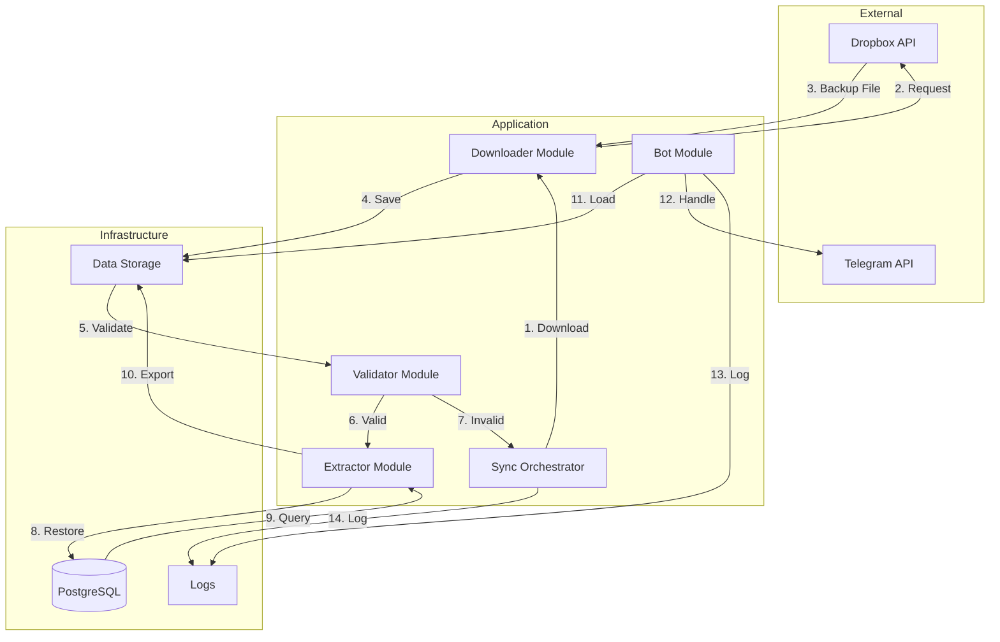
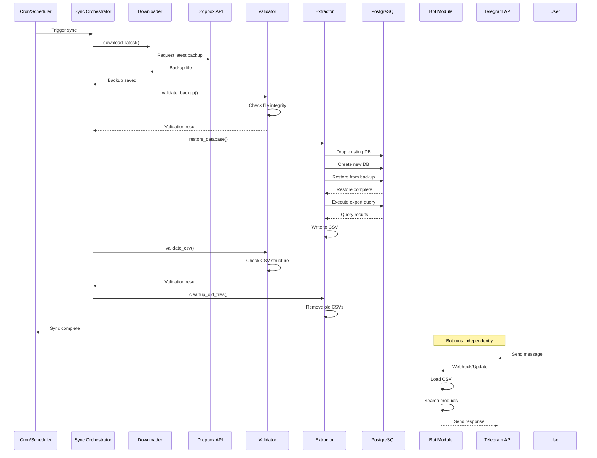
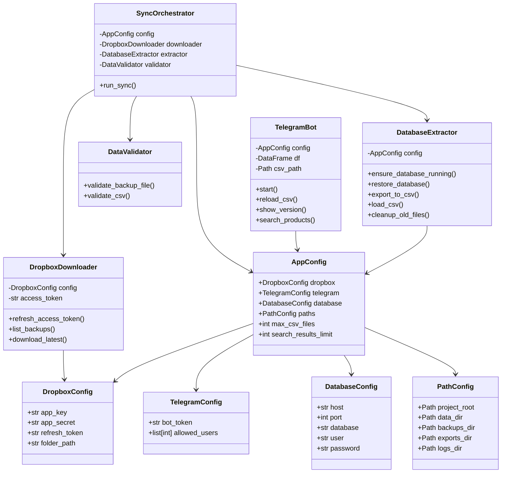
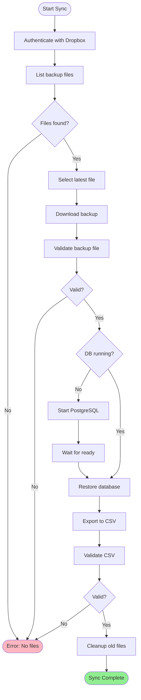
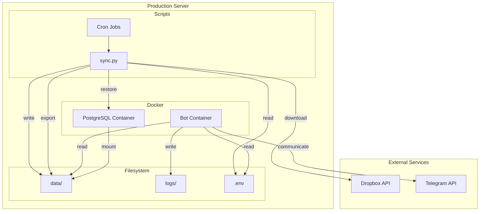
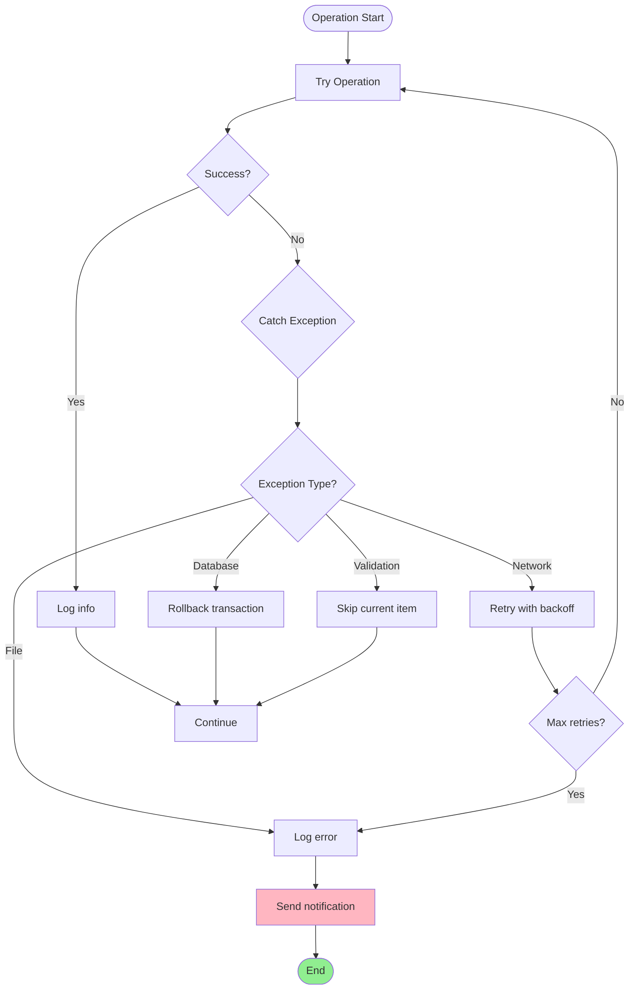
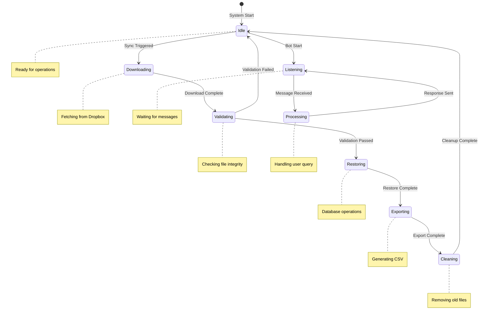
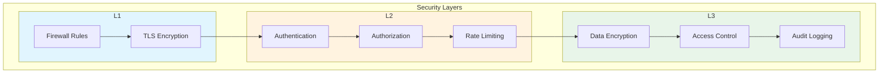
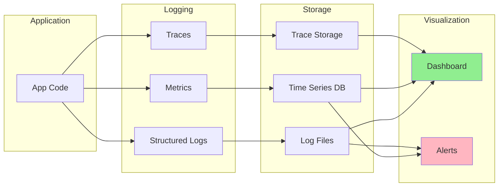

# Component Diagrams - Telegram Bot Toko

## System Overview

## Module Interactions

## Class Structure

## Data Flow Diagram

## Deployment Architecture

## Error Handling Flow

## State Transition Diagram

## Security Architecture

## Monitoring & Observability

