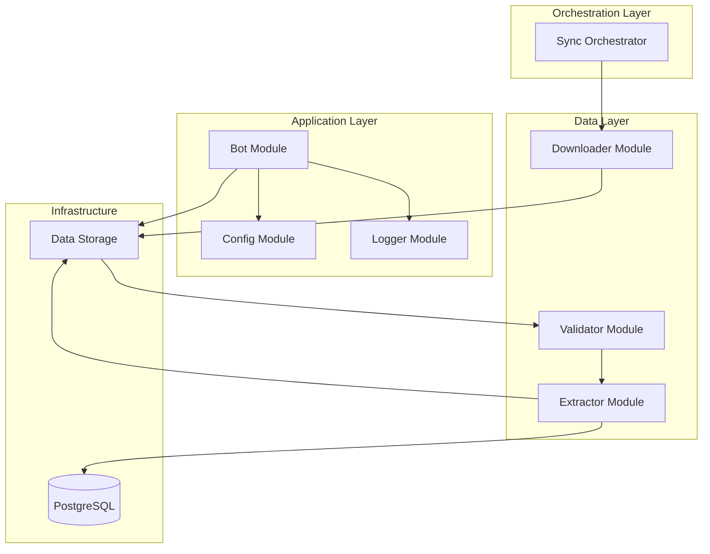

# Architecture Recommendations - Telegram Bot Toko

## Executive Summary

After analyzing the current project structure, I've identified several architectural issues and designed a comprehensive improvement plan. This document summarizes the key problems, proposed solutions, and implementation roadmap.

## Current State Analysis

### Existing Structure
```
telegram-bot-toko/
├── telegram-bot/
│   ├── bot.py
│   └── requirements.txt
├── i5bu-extract/
│   ├── extract.sh
│   ├── docker-compose.yml
│   └── output/
├── i5bu_files/
│   └── latest_backup.i5bu
├── download_latest_i5bu.sh
└── README.md
```

### Critical Issues Identified

#### 1. Security Vulnerabilities
- **Hardcoded credentials**: API tokens and secrets are embedded in source code
- **No environment separation**: Development and production use same configuration
- **Exposed secrets**: Dropbox refresh token and Telegram bot token in plain text

#### 2. Maintainability Problems
- **Monolithic design**: All logic in single files with no separation of concerns
- **Mixed responsibilities**: Shell scripts handle business logic, data processing, and orchestration
- **No modularity**: Cannot test or replace individual components

#### 3. Operational Challenges
- **Manual coordination**: Scripts must be run in specific sequence manually
- **No error recovery**: Failures require manual intervention
- **Limited monitoring**: Minimal logging makes troubleshooting difficult
- **No health checks**: Cannot detect if components are running properly

#### 4. Scalability Limitations
- **Single instance**: Cannot scale bot horizontally
- **No caching**: Every search loads entire CSV
- **Resource waste**: Database container recreated on each run
- **No queue system**: Cannot handle high load

## Proposed Solution

### New Architecture Overview

The proposed architecture follows **separation of concerns**, **modularity**, and **industry best practices**:



### Key Improvements

#### 1. Security Enhancements

**Environment-Based Configuration**
```python
# config/.env (gitignored)
DROPBOX_APP_KEY=your_key
DROPBOX_APP_SECRET=your_secret
DROPBOX_REFRESH_TOKEN=your_token
TELEGRAM_BOT_TOKEN=your_bot_token
```

**Benefits**:
- Credentials never committed to version control
- Easy to rotate secrets
- Different configs for dev/staging/prod
- Supports secrets management tools

#### 2. Modular Design

**Separate Modules for Each Concern**

| Module | Responsibility | Files |
|--------|---------------|-------|
| [`src/core/config.py`](src/core/config.py) | Configuration management | Load and validate settings |
| [`src/core/logger.py`](src/core/logger.py) | Logging setup | Structured logging |
| [`src/data/downloader.py`](src/data/downloader.py) | Dropbox integration | Download backups |
| [`src/data/validator.py`](src/data/validator.py) | Data validation | Verify integrity |
| [`src/bot/bot.py`](src/bot/bot.py) | Telegram bot | Handle messages |

**Benefits**:
- Easy to test individual components
- Can replace modules without affecting others
- Clear ownership and responsibility
- Better code organization

#### 3. Orchestration Layer

**Centralized Sync Process**

```python
# scripts/sync.py
def main():
    config = load_config()
    downloader = DropboxDownloader(config.dropbox)
    validator = DataValidator()
    extractor = DatabaseExtractor(config)

    # Coordinated workflow
    downloader.download_latest(backup_path)
    validator.validate_backup_file(backup_path)
    extractor.restore_database(backup_path)
    extractor.export_to_csv(csv_path)
    validator.validate_csv(csv_path)
    extractor.cleanup_old_files()
```

**Benefits**:
- Single entry point for data sync
- Automatic error handling and recovery
- Consistent execution flow
- Easy to monitor and debug

#### 4. Comprehensive Logging

**Structured Logging with Context**

```python
logger = get_logger('downloader')
logger.info(f"Downloading latest backup: {latest.name}")
logger.error(f"Failed to download: {e}", exc_info=True)
```

**Benefits**:
- Easy to trace issues
- Filterable by component and level
- Supports log aggregation tools
- Better debugging experience

#### 5. Docker Containerization

**Multi-Service Docker Compose**

```yaml
services:
  postgres:
    image: postgres:15-alpine
    healthcheck:
      test: ["CMD-SHELL", "pg_isready -U postgres"]

  bot:
    build: .
    depends_on:
      postgres:
        condition: service_healthy
```

**Benefits**:
- Consistent environment across machines
- Easy deployment and scaling
- Health checks for reliability
- Resource isolation

#### 6. Testing Infrastructure

**Comprehensive Test Suite**

```python
# tests/test_downloader.py
def test_refresh_access_token(downloader):
    with patch('requests.post') as mock_post:
        mock_post.return_value.json.return_value = {'access_token': 'new_token'}
        token = downloader.refresh_access_token()
        assert token == 'new_token'
```

**Benefits**:
- Catch bugs before deployment
- Refactor with confidence
- Document expected behavior
- Continuous integration ready

## Implementation Roadmap

### Phase 1: Foundation (Week 1)
**Goal**: Establish new structure and configuration

**Tasks**:
- [ ] Create directory structure
- [ ] Implement configuration management
- [ ] Set up environment variables
- [ ] Create logging infrastructure
- [ ] Move existing files to new locations

**Deliverables**:
- Modular directory structure
- Working configuration system
- Structured logging

### Phase 2: Data Layer (Week 2)
**Goal**: Extract and modularize data processing

**Tasks**:
- [ ] Implement downloader module
- [ ] Implement validator module
- [ ] Create data models
- [ ] Write unit tests

**Deliverables**:
- Tested downloader module
- Tested validator module
- Data models

### Phase 3: Application Layer (Week 3)
**Goal**: Refactor bot and create orchestration

**Tasks**:
- [ ] Refactor bot to use new modules
- [ ] Create sync orchestrator
- [ ] Implement error handling
- [ ] Write integration tests

**Deliverables**:
- Refactored bot
- Sync orchestrator
- Integration tests

### Phase 4: Deployment (Week 4)
**Goal**: Containerize and deploy

**Tasks**:
- [ ] Create Docker configuration
- [ ] Set up monitoring
- [ ] Configure cron jobs
- [ ] Deploy to production

**Deliverables**:
- Docker containers
- Monitoring setup
- Automated sync

### Phase 5: Optimization (Ongoing)
**Goal**: Improve performance and reliability

**Tasks**:
- [ ] Add caching layer
- [ ] Implement rate limiting
- [ ] Optimize database queries
- [ ] Add health checks

**Deliverables**:
- Improved performance
- Better reliability
- Enhanced monitoring

## Benefits Summary

### Immediate Benefits (After Phase 1-2)
- ✅ **Security**: Credentials no longer hardcoded
- ✅ **Maintainability**: Clear code organization
- ✅ **Debugging**: Structured logging
- ✅ **Testing**: Unit test infrastructure

### Short-term Benefits (After Phase 3-4)
- ✅ **Reliability**: Automated error handling
- ✅ **Deployment**: Docker containerization
- ✅ **Monitoring**: Health checks and alerts
- ✅ **Operations**: Single sync command

### Long-term Benefits (After Phase 5+)
- ✅ **Scalability**: Horizontal scaling capability
- ✅ **Performance**: Caching and optimization
- ✅ **Flexibility**: Easy to add features
- ✅ **Maintainability**: Easy to onboard new developers

## Risk Assessment

### Low Risk
- Directory restructuring (non-breaking)
- Adding logging (non-breaking)
- Creating tests (non-breaking)

### Medium Risk
- Refactoring bot (requires testing)
- Docker deployment (requires validation)
- Cron job configuration (requires testing)

### Mitigation Strategies
1. **Backup**: Complete backup before migration
2. **Testing**: Comprehensive test suite
3. **Staging**: Test in staging environment first
4. **Rollback**: Detailed rollback plan
5. **Monitoring**: Close monitoring after deployment

## Resource Requirements

### Development
- **Time**: 4 weeks for full migration
- **Skills**: Python, Docker, Shell scripting
- **Tools**: Git, pytest, Docker Compose

### Infrastructure
- **Server**: Linux with Docker support
- **Storage**: ~1GB for backups and logs
- **Network**: Internet access for Dropbox and Telegram APIs

### Maintenance
- **Time**: 1-2 hours per week for monitoring
- **Tasks**: Review logs, update dependencies, handle issues

## Alternatives Considered

### Option 1: Minimal Refactoring
**Approach**: Only extract credentials to environment variables

**Pros**:
- Quick to implement
- Low risk

**Cons**:
- Doesn't address maintainability
- No modularity
- Limited improvement

**Decision**: ❌ Not recommended - insufficient improvement

### Option 2: Full Rewrite
**Approach**: Rewrite entire application from scratch

**Pros**:
- Clean slate
- Modern architecture

**Cons**:
- High risk
- Long timeline
- Loss of existing functionality

**Decision**: ❌ Not recommended - too risky

### Option 3: Gradual Migration (Recommended)
**Approach**: Incremental refactoring with new architecture

**Pros**:
- Manageable risk
- Continuous delivery
- Can test each phase
- Rollback capability

**Cons**:
- Requires planning
- Takes time

**Decision**: ✅ Recommended - best balance of risk and benefit

## Next Steps

### Immediate Actions
1. **Review Documentation**
   - Read [`ARCHITECTURE.md`](ARCHITECTURE.md) for detailed design
   - Review [`COMPONENTS.md`](COMPONENTS.md) for diagrams
   - Study [`MIGRATION.md`](MIGRATION.md) for implementation plan

2. **Approve Plan**
   - Review this recommendations document
   - Discuss with team
   - Approve or request changes

3. **Prepare Environment**
   - Backup current system
   - Set up development environment
   - Create staging environment

### Decision Required

Please choose one of the following options:

**Option A**: Proceed with full migration as outlined
- Implement all phases over 4 weeks
- Complete architecture overhaul
- Maximum long-term benefits

**Option B**: Start with Phase 1 only (foundation)
- Implement configuration and logging
- Test new structure
- Decide on further phases

**Option C**: Custom approach
- Select specific improvements
- Prioritize based on needs
- Adjust timeline

## Conclusion

The proposed architecture addresses all critical issues in the current system while providing a solid foundation for future growth. The modular design, proper configuration management, and comprehensive testing will significantly improve maintainability, security, and reliability.

The migration plan is designed to be low-risk with clear phases, testing at each step, and rollback capability. With 4 weeks of focused effort, the system can be transformed into a production-ready, scalable application.

**Recommendation**: Proceed with Option A (full migration) to achieve maximum long-term benefits and establish a solid foundation for future enhancements.

## Questions & Support

If you have questions about any aspect of this proposal:
- Review the detailed documentation in the `docs/` directory
- Refer to the migration plan for implementation details
- Contact the architecture team for clarification

---

**Document Version**: 1.0
**Last Updated**: 2025-01-04
**Status**: Pending Approval
